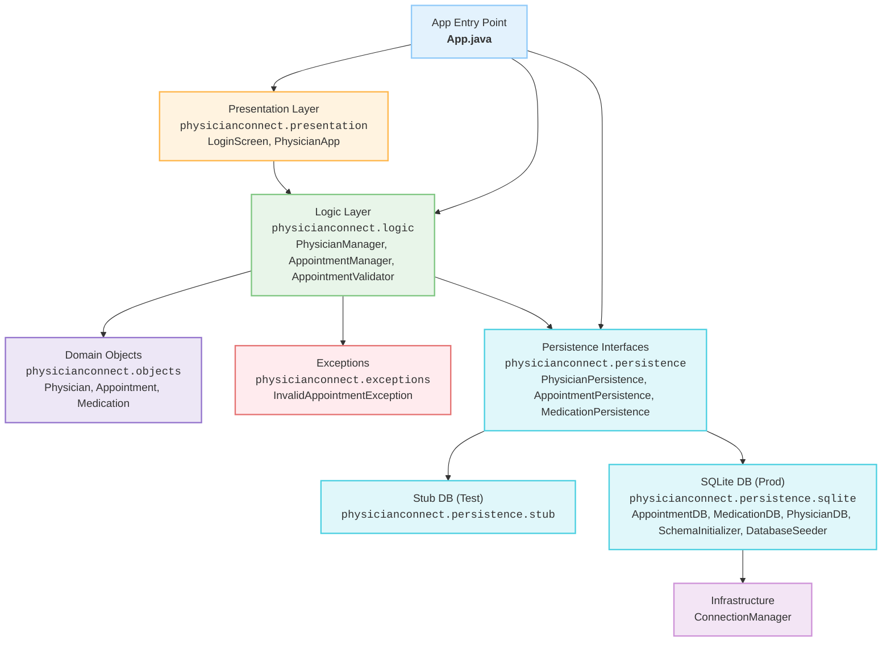

```mermaid
flowchart TD
    %% Theme & Styling
    classDef entryPoint fill:#e3f2fd,stroke:#90caf9,stroke-width:2px;
    classDef presentation fill:#fff3e0,stroke:#ffb74d,stroke-width:2px;
    classDef logic fill:#e8f5e9,stroke:#81c784,stroke-width:2px;
    classDef domain fill:#ede7f6,stroke:#9575cd,stroke-width:2px;
    classDef exceptions fill:#ffebee,stroke:#e57373,stroke-width:2px;
    classDef persistence fill:#e0f7fa,stroke:#4dd0e1,stroke-width:2px;
    classDef infra fill:#f3e5f5,stroke:#ce93d8,stroke-width:2px;

    %% Nodes
    MAIN["App Entry Point<br><b>App.java</b>"]:::entryPoint

    UI["Presentation Layer<br><code>physicianconnect.presentation</code><br>LoginScreen, PhysicianApp"]:::presentation

    LM["Logic Layer<br><code>physicianconnect.logic</code><br>PhysicianManager, AppointmentManager, AppointmentValidator"]:::logic

    OBJ["Domain Objects<br><code>physicianconnect.objects</code><br>Physician, Appointment, Medication"]:::domain

    EXC["Exceptions<br><code>physicianconnect.exceptions</code><br>InvalidAppointmentException"]:::exceptions

    PI["Persistence Interfaces<br><code>physicianconnect.persistence</code><br>PhysicianPersistence, AppointmentPersistence, MedicationPersistence"]:::persistence

    STUB["Stub DB (Test)<br><code>physicianconnect.persistence.stub</code>"]:::persistence

    SQLITE["SQLite DB (Prod)<br><code>physicianconnect.persistence.sqlite</code><br>AppointmentDB, MedicationDB, PhysicianDB, SchemaInitializer, DatabaseSeeder"]:::persistence

    CM["Infrastructure<br>ConnectionManager"]:::infra

    %% Flow Connections
    MAIN --> UI
    MAIN --> LM
    MAIN --> PI

    UI --> LM
    LM --> OBJ
    LM --> EXC
    LM --> PI

    PI --> STUB
    PI --> SQLITE
    SQLITE --> CM

```