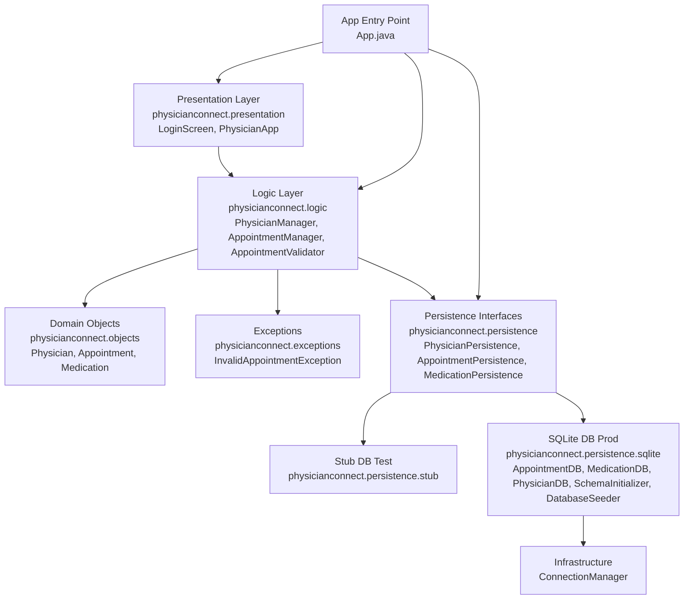

```mermaid
flowchart TD
    %% Presentation Layer
    UI[Presentation Layer\nphysicianconnect.presentation\nLoginScreen, PhysicianApp]

    %% Logic Layer
    LM[Logic Layer\nphysicianconnect.logic\nPhysicianManager, AppointmentManager, AppointmentValidator]

    %% Domain Objects
    OBJ[Domain Objects\nphysicianconnect.objects\nPhysician, Appointment, Medication]

    %% Exceptions
    EXC[Exceptions\nphysicianconnect.exceptions\nInvalidAppointmentException]

    %% Persistence Interfaces and Implementations
    PI[Persistence Interfaces\nphysicianconnect.persistence\nPhysicianPersistence, AppointmentPersistence, MedicationPersistence]
    STUB[Stub DB Test\nphysicianconnect.persistence.stub]
    SQLITE[SQLite DB Prod\nphysicianconnect.persistence.sqlite\nAppointmentDB, MedicationDB, PhysicianDB, SchemaInitializer, DatabaseSeeder]

    %% Infrastructure
    CM[Infrastructure\nConnectionManager]

    %% Main Entry Point
    MAIN[App Entry Point\nApp.java]

    %% Flow Connections
    MAIN --> UI
    MAIN --> LM
    MAIN --> PI

    UI --> LM
    LM --> OBJ
    LM --> EXC
    LM --> PI

    PI --> STUB
    PI --> SQLITE
    SQLITE --> CM
```