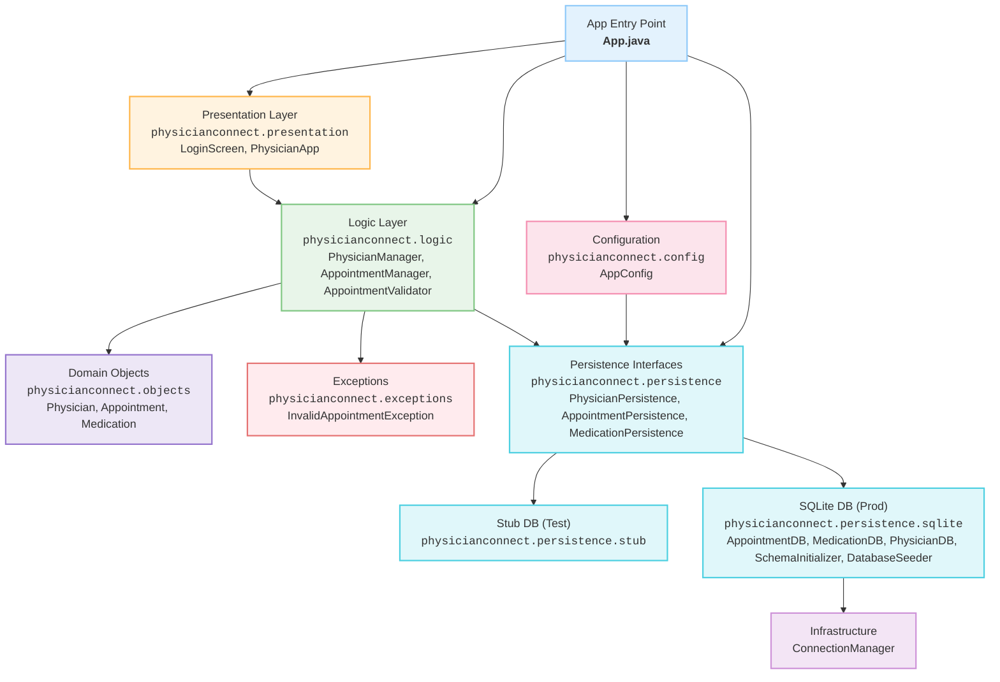

## Dependency Injection Configuration

The application uses a simple but effective dependency injection pattern to switch between different persistence implementations. This is achieved through the following components:

### 1. AppConfig
Located in `physicianconnect.config.AppConfig`, this class provides a centralized configuration point for the application. It manages:
- The persistence type (PROD, TEST, or STUB)
- Whether to seed initial data
- Other application-wide settings

### 2. PersistenceType Enum
Defines the available persistence implementations:
- `PROD`: Uses SQLite database for production
- `TEST`: Uses SQLite database with test configuration
- `STUB`: Uses in-memory stub implementations for testing

### 3. PersistenceFactory
The factory class that creates and manages persistence implementations based on the configuration. It provides:
- Centralized initialization of all persistence components
- Automatic fallback to stub implementations if database initialization fails
- Clean separation between persistence interfaces and their implementations

### Usage Example

To switch between persistence implementations, simply update the configuration:

```java
// Use SQLite in production
AppConfig.setPersistenceType(PersistenceType.PROD);

// Use in-memory stubs for testing
AppConfig.setPersistenceType(PersistenceType.STUB);

// Use SQLite with test configuration
AppConfig.setPersistenceType(PersistenceType.TEST);
```

The application will automatically use the appropriate implementation based on this configuration.