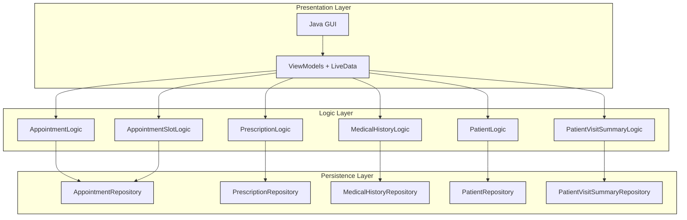

# PhysicianConnect Architecture

PhysicianConnect is a healthcare application platform that assists patients and physicians to communicate effectively. This system consists of modular components to support appointment booking, care plan management, medical history tracking, and medication handling. The architecture emphasizes clean separation of concerns, detailed test coverage and maintainability.

## 1.1 Components

### 1.11 Data Model

The core domain models represent real-world healthcare entities and relationships:

`Patient`: 
- Stores personal and medical profile data, including contact info and medical history.

`Physician`:
- Includes scheduling availability and professional identifiers.

`Appointment`:
- Links patients and physicians with date/time, notes, and status.

`Prescription`:
- Contains medication details, dosage, and instructions.

`Referral`:
- Links patients to tests or specialists and includes preparation notes.

`MedicalHistory`:
- Stores past appointments, diagnoses, and treatments.

`PatientVisitSummary`:
- Records visit details including date/time, physician, duration, and feedback.

These models are designed with encapsulation and validation in mind, allowing safe and consistent domain operations.

### 1.12 Persistence/Data Layer

This system uses a repository interface pattern to abstract data access. During early development, stub implementations back these repositories using in-memory data structures such as List and Map.

**Repositories:**

- `AppointmentRepository`
- `MedicalHistoryRepository`
- `PrescriptionRepository`
- `ReferralRepository`
- `PatientRepository`
- `PatientVisitSummaryRepository`

**Benefits/Pros:**

- Clean separation between logic and storage
- Easy swapping of stubbed and persistent implementations
- Support for unit testing without external dependencies

### 1.13 Logic Layer

This layer contains services that manage business logic and coordination across multiple repositories or models:

**Logic Classes:**

- `AppointmentLogic`: Handles appointment scheduling, validation, and status management
- `AppointmentSlotLogic`: Manages physician availability and slot creation
- `MedicalHistoryLogic`: Processes patient medical records and history
- `PatientLogic`: Manages patient data and profile operations
- `PrescriptionLogic`: Handles medication prescriptions and updates
- `PatientVisitSummaryLogic`: Processes visit summaries and feedback

Each logic class includes:
- Input validation
- Error handling
- Logging
- Business rule enforcement
- Data consistency checks

### 1.14 Presentation Layer

The Java GUI app is organized using:

- Activities and Fragments (examples: AppointmentBookingView, PrescriptionView, etc.)
- ViewModels with LiveData for state management
- Material Design components for consistency and usability

GUI communicates with the logic layer via ViewModels, keeping GUI logic separate from core application behavior.

## 1.2 Architecture Diagrams

### 1.21 Component Diagram



<p align="center"><b>Figure 1</b>: High Level Architecture Diagram of <i>PhysicianConnect</i></p>

This diagram shows the layered flow where ViewModels connect the Java GUI to application logic, services manage complex operations and coordinate calls, and repositories handle data storage and retrieval.

## 1.3 Package Structure

The application follows a clean, layered architecture with the following package structure:

```
physicianconnect/
├── logic/
│   ├── stub/
│   │   ├── AppointmentLogic.java
│   │   ├── AppointmentSlotLogic.java
│   │   ├── MedicalHistoryLogic.java
│   │   ├── PatientLogic.java
│   │   ├── PhysicianLogic.java
│   │   ├── PrescriptionLogic.java
│   │   └── PatientVisitSummaryLogic.java
│   ├── interfaces/
│   └── implementations/
├── persistence/
│   └── stub/
│       ├── AppointmentStub.java
│       ├── AppointmentSlotStub.java
│       ├── MedicalHistoryStub.java
│       ├── PatientStub.java
│       ├── PrescriptionStub.java
│       ├── PhysicianStub.java
│       └── PatientVisitSummaryStub.java
├── presentation/
├── objects/
└── exceptions/
```

## 1.4 Feature Coverage

This section shows where **each key feature** is addressed within the architecture.

### 1.41 Patient-Facing Features

- **Appointment Booking & Management** (`Feature #1 & Feature #2`): 
  - Handled by `AppointmentLogic` and `AppointmentSlotLogic`
  - Uses `AppointmentStub` for data persistence
  - Includes validation and error handling

- **Medication Instructions** (`Feature #3`): 
  - Managed by `PrescriptionLogic`
  - Validates prescription data and handles updates
  - Uses `PrescriptionStub` for storage

- **View Referrals** (`Feature #4`): 
  - Managed by `ReferralLogic`
  - Displays via `ReferralStub` and UI components

- **Pre-Appointment Notes** (`Feature #5`): 
  - Notes stored within Appointment model
  - Validated and processed by `AppointmentLogic`

- **Patient Feedback & Ratings** (`Feature #6`): 
  - Collected through `PatientVisitSummaryLogic`
  - Stored in `PatientVisitSummaryStub`

### 1.42 Physician-Facing Features:

- **Appointment Slot Management** (`Feature #7`): 
  - Managed via `AppointmentSlotLogic`
  - Includes conflict resolution and validation

- **View Patient's Medical History** (`Feature #8`): 
  - Displayed via `MedicalHistoryLogic`
  - Pulls from `MedicalHistoryStub`

- **Create Referrals** (`Feature #9`): 
  - Managed through `ReferralLogic`
  - Stored via `ReferralStub`

- **Medication Prescription** (`Feature #10`): 
  - Implemented via `PrescriptionLogic`
  - Uses `PrescriptionStub` for persistence

- **Health Resource Sharing** (`Feature #11`): 
  - Integrated with referral and prescription delivery logic
  - Managed through appropriate logic classes

This architecture ensures each feature has a clearly defined place in the system, supporting testability, clarity, and extensibility. The layered approach allows for easy maintenance and future enhancements while maintaining clean separation of concerns.
